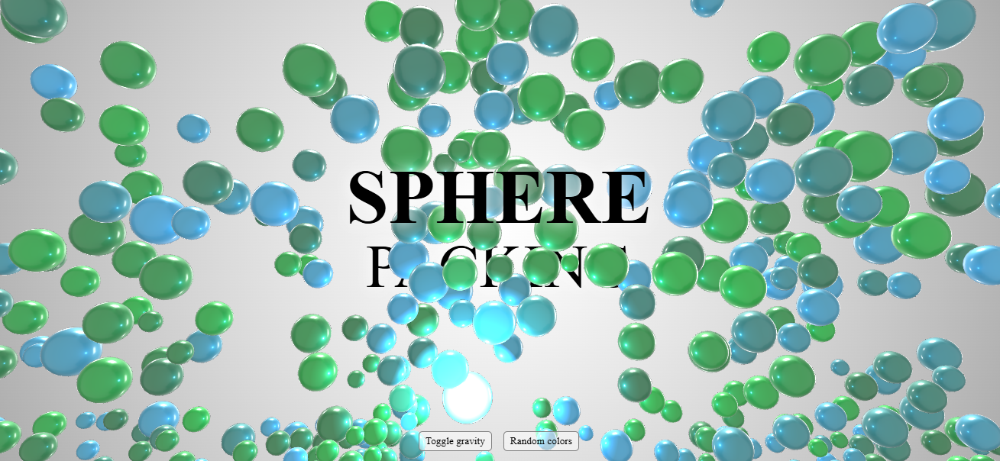

# GravitySpheres

This project demonstrates an interactive 3D sphere packing visualization using WebGL and Three.js components. The application features a mesmerizing display of spheres that respond to gravity and color changes triggered by user interactions.

## Features

- **3D Sphere Packing:** A dynamic background with 300 spheres, varying in size and responding to gravity.
- **Interactive Controls:**
  - **Toggle Gravity:** Enable or disable the gravitational effect on the spheres.
  - **Random Colors:** Randomize the colors of the spheres for a vibrant visual effect.
- **Responsive Design:** Scales seamlessly across devices, maintaining a beautiful user experience.

<!--## Installation

To run this project locally:-->

## How to Use
1. Clone this repository or download the project files.
2. Open  the downloaded files in the VS Code.
3. Install the **Live Server extension** in VS Code.
4. Right-click your index.html file in VS Code.
   Select "Open with Live Server" to see the 3D simulation in action.
6. Use the buttons to toggle gravity and change sphere colors dynamically.

<!--## Preview

 Add your image path here 

 ## Live Demo

You can see the live demo here: [Sphere Gravity Demo](https://...) -->

## Screenshots

### Initial View:

### After Toggle Gravity:

### Randomized Colors:

## Technologies Used

- **HTML**: For structuring the application.
- **CSS**: For styling the interface.
- **JavaScript**: For interactive functionalities.
- **Three.js Components**: For rendering the 3D spheres.

## Customization

You can easily customize the simulation:

- Change the number of spheres by modifying the count parameter.
- Adjust the sphere sizes by modifying the minSize and maxSize parameters.
- Modify the gravity setting for a different visual effect.
- Feel free to adjust the parameters in the script.js file to match your needs!

-----------------------------------------------------------------------------------------------------------------------

Feel free to contribute by submitting issues, fork this repository and send pull requests. 
Contributions are welcome!
